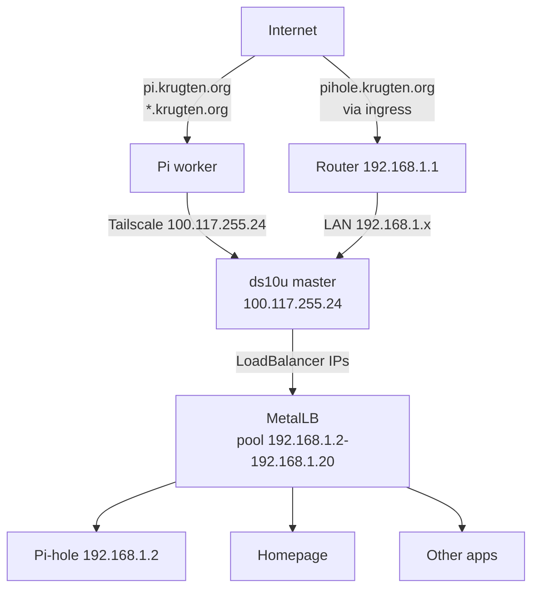
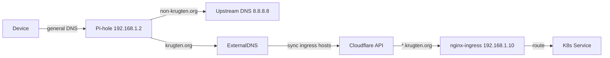

# Architecture

## Network topology

### Tailscale

All nodes connect via Tailscale (Wireguard mesh). The master (`ds10u`) has IP `100.117.255.24` and advertises the LAN route `192.168.1.0/24` to the tailnet. This allows the remote worker (`pi`) to reach LAN resources through the master.

### MetalLB

[MetalLB](https://metallb.io/) runs in L2 mode and allocates IPs from `192.168.1.2-192.168.1.20` for LoadBalancer services. It uses ARP to announce these IPs on the LAN, making services directly reachable without cloud LBs.

Services with LoadBalancer IPs:
- Pi-hole: `192.168.1.2`

### K3s cluster

| Component | Detail |
|-----------|--------|
| Master | `ds10u` — runs control plane + workloads |
| Worker | `pi` — runs workloads only |
| CNI | Flannel (K3s default) |
| Ingress | nginx-ingress (Traefik disabled via `--disable traefik`) |
| DNS | CoreDNS |
| Storage | hostPath + PVC (Longhorn/local-path-provisioner) |

### DNS chain

All LAN devices get `192.168.1.2` as DNS via DHCP. Pi-hole handles ad-blocking and local DNS. ExternalDNS syncs ingress hostnames to Cloudflare DNS.

### TLS

`cert-manager` with `letsencrypt-prod` ClusterIssuer handles automatic TLS for all ingress hosts. It uses DNS01 challenge via Cloudflare API token for wildcard/proof of domain ownership.

### Secrets management

Secrets are stored in Ansible Vault (`inventory/production/group_vars/all/vault.yml`) and injected into Kubernetes via:
- `kubectl create secret` tasks in `k8s-base` role (Cloudflare API token)
- Direct use in Ansible templates (Home Assistant configs)
- Kubernetes secrets created from Ansible variables
