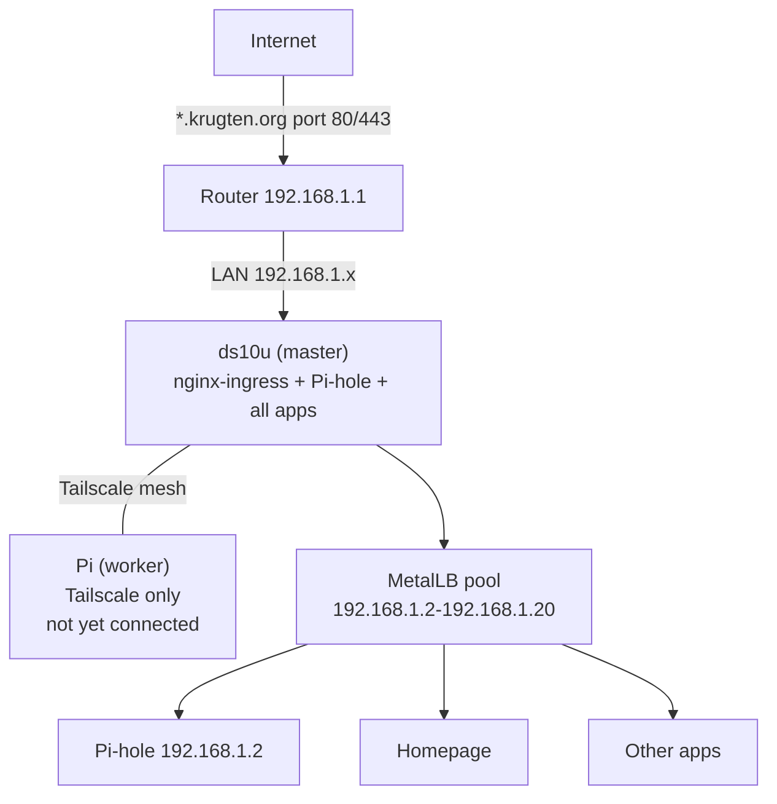
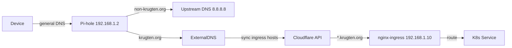

# Architecture

## Network topology

```mermaid
flowchart TD
    Internet[Internet]
    Router[Router 192.168.1.1]
    DS10U["ds10u (master)<br/>nginx-ingress + Pi-hole + all apps"]
    Pi["Pi (worker)<br/>Tailscale only<br/>not yet connected"]
    MetalLB[MetalLB pool<br/>192.168.1.2-192.168.1.20]
    Pihole[Pi-hole 192.168.1.2]
    Homepage[Homepage]
    Others[Other apps]

    Internet -->|"*.krugten.org port 80/443"| Router
    Router -->|LAN 192.168.1.x| DS10U
    DS10U --> MetalLB
    MetalLB --> Pihole
    MetalLB --> Homepage
    MetalLB --> Others
    DS10U ---|Tailscale mesh| Pi
```

### Tailscale

All nodes connect via Tailscale (Wireguard mesh). The master (`ds10u`) has IP `100.117.255.24` and advertises the LAN route `192.168.1.0/24` to the tailnet. This allows the remote worker (`pi`) to reach LAN resources through the master.

### MetalLB

[MetalLB](https://metallb.io/) runs in L2 mode and allocates IPs from `192.168.1.2-192.168.1.20` for LoadBalancer services. It uses ARP to announce these IPs on the LAN, making services directly reachable without cloud LBs.

Services with LoadBalancer IPs:
- Pi-hole: `192.168.1.2`

### K3s cluster

| Component | Detail |
|-----------|--------|
| Master | `ds10u` — runs control plane + workloads |
| Worker | `pi` — not yet joined, Tailscale connected |
| CNI | Flannel (K3s default) |
| Ingress | nginx-ingress (Traefik disabled via `--disable traefik`) |
| DNS | CoreDNS |
| Storage | hostPath + PVC (K3s local-path-provisioner) |

### DNS chain

```mermaid
flowchart LR
    Device[Device]
    Pihole[Pi-hole 192.168.1.2]
    Upstream[Upstream DNS 8.8.8.8]
    ExternalDNS[ExternalDNS]
    Cloudflare[Cloudflare API]
    Ingress[nginx-ingress 192.168.1.10]
    Service[K8s Service]

    Device -->|general DNS| Pihole
    Pihole -->|non-krugten.org| Upstream
    Pihole -->|krugten.org| ExternalDNS
    ExternalDNS -->|sync ingress hosts| Cloudflare
    Cloudflare -->|*.krugten.org| Ingress
    Ingress -->|route| Service
```

All LAN devices get `192.168.1.2` as DNS via DHCP. Pi-hole handles ad-blocking and local DNS. ExternalDNS syncs ingress hostnames to Cloudflare DNS.

Devices **away from home** reach the same Pi-hole through Tailscale. The tailnet's DNS page lists `100.117.255.24` as a global nameserver with *Override local DNS* enabled, so every connected client sends its lookups to Pi-hole regardless of what the local network offered. That address is served by an `externalIPs` entry on the Pi-hole Service — the MetalLB VIP `192.168.1.2` is announced by ARP and answers on the LAN only, which would otherwise make remote filtering depend on each client accepting the `192.168.1.0/24` subnet route.

This does not run through the exit node. Advertising `ds10u` as an exit node was the original mechanism, on the mistaken belief that custom global nameservers were a paid feature; it left the DNS page empty and remote devices unfiltered. The exit node is still advertised, but DNS no longer depends on it.

### TLS

`cert-manager` with `letsencrypt-prod` ClusterIssuer handles automatic TLS for all ingress hosts. It uses DNS01 challenge via Cloudflare API token for wildcard/proof of domain ownership.

### Secrets management

Secrets are stored in Ansible Vault (`inventory/production/group_vars/all/vault.yml`) and injected into Kubernetes via:
- `kubectl create secret` tasks in `k8s-base` role (Cloudflare API token)
- Direct use in Ansible templates (Home Assistant configs)
- Kubernetes secrets created from Ansible variables
