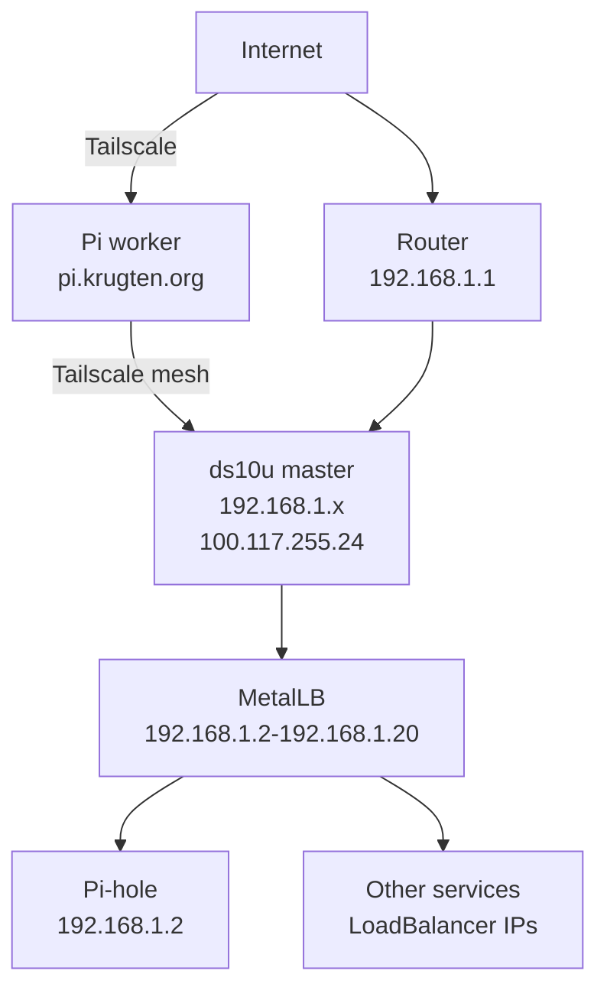

# Home

Ansible-managed homelab running [K3s](https://k3s.io/) on two nodes with Tailscale networking, MetalLB load balancing, and 12+ self-hosted applications behind a Let's Encrypt ingress.

## Hardware

| Host | Role | Platform | Location | OS |
|------|------|----------|----------|----|
| **ds10u** | K3s master | x86_64 (NUC) | LAN (192.168.1.x) + Tailscale | Debian |
| **pi** | K3s worker | aarch64 (Raspberry Pi) | Remote via `pi.krugten.org` | Debian |

## Network



## Stack

| Layer | Technology |
|-------|-----------|
| Config management | Ansible 14 (core 2.21) |
| Kubernetes | K3s (single master + worker) |
| Service mesh | Tailscale (Wireguard) |
| Load balancing | MetalLB (L2 mode) |
| Ingress | nginx-ingress |
| DNS | Pi-hole + ExternalDNS (Cloudflare) |
| TLS | cert-manager + Let's Encrypt |
| Backups | restic + systemd timer |
| Debugging | [Kubernetes Operations](Kubernetes-Operations) |
| Secrets | Ansible Vault |

## Quick start

```bash
source ~/ansible-env/bin/activate
make bootstrap   # Common + server config
make k3s         # Tailscale + K3s install
make manifests   # Deploy all K8s apps
make backup      # Set up restic backups
```
