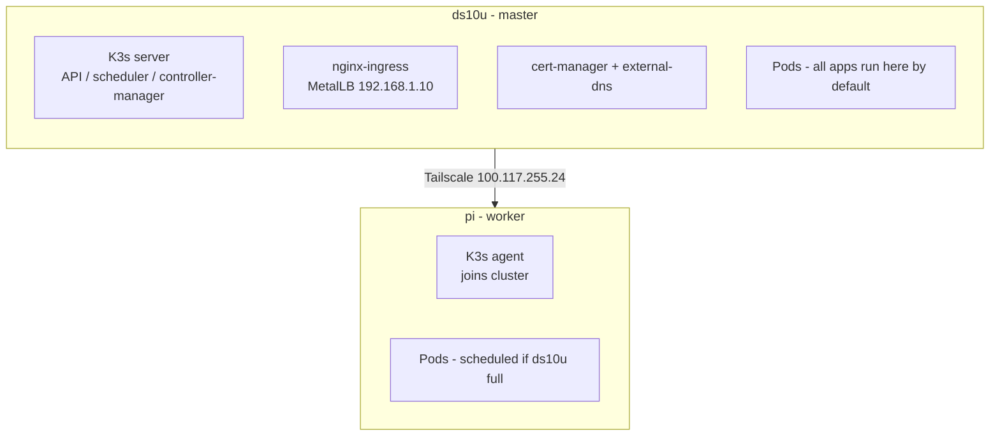
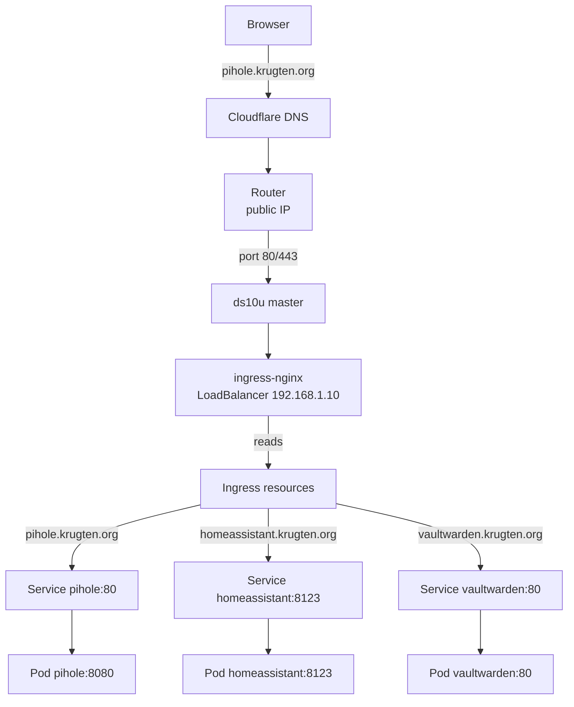

# Kubernetes Operations

Your K3s cluster: **ds10u** (master, x86_64) + **pi** (worker, aarch64).

---

## Kubernetes Concepts (Cheat Sheet)

A quick mental model of the resources you'll see daily:

| Resource | What it is | How you interact |
|----------|-----------|------------------|
| **Node** | A physical/virtual machine in the cluster (`ds10u`, `pi`) | `kubectl get nodes` |
| **Pod** | One or more containers that run together — the smallest deployable unit | Deployments create & manage pods. A pod gets an internal cluster IP. |
| **Deployment** | Declares *how many* pod replicas you want, what image to run, and handles rollouts | You manage deployments, Kubernetes keeps pods alive. |
| **Service** | Stable network endpoint (IP + port) pointing to a set of pods by label | Services label-match pods. A Service without matching pods has **no endpoints**. |
| **Ingress** | HTTP/HTTPS rules that route external traffic to Services | Routes `pihole.krugten.org` -> nginx-ingress -> Service `pihole:80` |
| **Ingress Controller** | The actual software that reads Ingress resources and configures the reverse proxy | You run `ingress-nginx` as a Deployment in `ingress-nginx` namespace. |
| **ConfigMap / Secret** | Configuration data injected into pods as env vars or files | Secrets are base64-encoded. Your Cloudflare token is a Secret. |
| **PVC / PV** | Persistent storage claim (PVC) that binds to a Persistent Volume (PV) | local-path provisioner auto-creates PVs on the node's disk. |
| **Certificate** | cert-manager resource that provisions Let's Encrypt TLS certs | Each app has a Certificate + Ingress with `tls` section. |
| **Namespace** | Logical isolation group for resources | Your apps are split across namespaces (see table below). |
| **LoadBalancer** | Service type that gets an external IP (via MetalLB) | Pi-hole DNS uses `LoadBalancer` IP `192.168.1.2`. |

**Pod Lifecycle states** (you'll see these in `kubectl get pods`):

| Status | Meaning |
|--------|---------|
| `Running` | Healthy — containers are up |
| `Pending` | Scheduled but not running (pulling image, waiting for resources, PVC not bound) |
| `CrashLoopBackOff` | Container starts, crashes, restarts, crashes again |
| `ImagePullBackOff` | Container image can't be pulled (wrong name, registry down, no auth) |
| `ErrImagePull` | Same as above — transient |
| `Terminating` | Pod is shutting down (stuck if finalizer or volume unmount fails) |
| `Completed` | Pod ran to completion (job, not a long-running service) |

**How traffic reaches your apps:**

```
Browser ──> pihole.krugten.org ──> DNS (Cloudflare) ──> Router (port 443) ──> ds10u
                                                                                │
                                                                        ingress-nginx
                                                                        (MetalLB 192.168.1.10)
                                                                                │
                                                                           Ingress rules
                                                                                │
                                                                         Service pihole
                                                                                │
                                                                        Pod pihole (container)
```

---

## Getting Started

### Prerequisites

```bash
# From your laptop — activate the ansible environment
source ~/ansible-env/bin/activate
```

### Access the cluster from your laptop

The admin kubeconfig lives on `ds10u`. Copy it once:

```bash
scp ds10u:/etc/rancher/k3s/k3s.yaml ~/.kube/config
sed -i 's/127.0.0.1/100.117.255.24/' ~/.kube/config   # patch to Tailscale IP
chmod 600 ~/.kube/config
```

Verify it works:

```bash
kubectl cluster-info
kubectl get nodes -o wide
kubectl get pods -A
```

If you see `The connection to the server 100.117.255.24:6443 was refused`:
- Check that `ds10u` is reachable: `ping 100.117.255.24`
- Check K3s is running: `ssh ds10u sudo systemctl status k3s`
- Check Tailscale: `ssh ds10u tailscale status`

### Contexts and namespaces

```bash
# See current context
kubectl config current-context
kubectl config get-contexts

# Switch default namespace for this context (so you don't need -n every time)
kubectl config set-context --current --namespace=krugten    # or pihole, media, etc.

# List everything across all namespaces
kubectl get pods -A
kubectl get all -A                                          # pods, services, deployments
```

**Pro tip:** Most commands below use `-n <namespace>` to specify the namespace. If you set a default namespace (above), you can omit it.

---

## Your Applications

### Namespaces, services, and domains

| Namespace | App(s) | Pod name(s) | DNS name (`*.krugten.org`) | Internal port |
|-----------|--------|-------------|---------------------------|---------------|
| `cert-manager` | cert-manager, webhook, cainjector | `cert-manager-*` | — | — |
| `external-dns` | external-dns | `external-dns-*` | — | — |
| `metallb-system` | controller, speaker | `controller-*`, `speaker-*` | — | — |
| `ingress-nginx` | nginx-ingress controller | `ingress-nginx-controller-*` | — | — |
| `pihole` | Pi-hole (DNS + web admin) | `pihole-*` | `pihole.krugten.org` | 80 (web), 53 (DNS) |
| `home-assistant` | Home Assistant | `home-assistant-*` | `homeassistant.krugten.org` | 8123 |
| `vaultwarden` | Vaultwarden (Bitwarden) | `vaultwarden-*` | `vaultwarden.krugten.org` | 80 |
| `mealie` | Mealie (recipe manager) | `mealie-*` | `mealie.krugten.org` | 9000 |
| `kuma` | Uptime Kuma | `kuma-*` | `kuma.krugten.org` | 3001 |
| `homepage` | Homepage dashboard | `homepage-*` | `home.krugten.org` | 3000 |
| `tuliprox` | TuliProx (IPTV proxy) | `tuliprox-*` | `iptv.krugten.org` | 8080 |
| `books` | Calibre (e-book library) | `calibre-*` | `calibre.krugten.org` | 8080 |
| `media` | qBittorrent, Prowlarr, Readarr | `qbittorrent-*`, `prowlarr-*`, `readarr-*` | `*.krugten.org` | 8080/9696/8787 |
| `paperless` | Paperless-ngx + Postgres + Redis | `paperless-*`, `postgres-*`, `redis-*` | `paperless.krugten.org` | 8000 |

**Important:** All ingress traffic arrives via `ingress-nginx` on MetalLB IP **192.168.1.10**. Your router forwards ports 80/443 to this IP.

Pi-hole DNS gets a dedicated LoadBalancer IP **192.168.1.2** (at the start of the MetalLB pool range).

### Quick health check

Run this to see if everything is healthy:

```bash
# All pods should be Running or Completed
kubectl get pods -A

# Check for any non-Ready pods
kubectl get pods -A | grep -v Running | grep -v Completed

# All ingresses should list a host and have TLS configured
kubectl get ingress -A

# All certificates should be Ready
kubectl get certificate -A
```

---

## Day-to-Day Operations

### Viewing pod status

```bash
# Basic list
kubectl get pods -n pihole

# With more detail (node, IP, readiness)
kubectl get pods -n pihole -o wide

# Watch changes in real time
kubectl get pods -n pihole -w

# Show labels (useful for understanding selectors)
kubectl get pods -n pihole --show-labels

# Custom columns (e.g. just name, status, and restarts)
kubectl get pods -A -o custom-columns=NAME:.metadata.name,STATUS:.status.phase,RESTARTS:.status.containerStatuses[0].restartCount
```

### Reading logs

```bash
# Follow logs from a specific pod
kubectl logs -f pihole-xxxxx -n pihole

# Follow logs from all pods matching a label
kubectl logs -f -l app=pihole -n pihole

# Follow logs from a deployment (shorthand)
kubectl logs -f deploy/pihole -n pihole

# Last 50 lines (no follow)
kubectl logs --tail=50 deploy/pihole -n pihole

# Logs from previous crashed instance
kubectl logs -p pihole-xxxxx -n pihole

# Multiple containers in a pod (e.g. Paperless)
kubectl logs -f deploy/paperless -n paperless -c paperless
kubectl logs -f deploy/paperless -n paperless -c redis     # or postgres

# All containers at once (--all-containers or -c with tab-complete)
```

### Exec into a container

```bash
# Interactive shell
kubectl exec -it deploy/pihole -n pihole -- /bin/bash
kubectl exec -it pihole-xxxxx -n pihole -- sh

# Run a single command
kubectl exec deploy/pihole -n pihole -- pihole status

# Multiple containers in a pod
kubectl exec -it deploy/paperless -n paperless -c paperless -- bash
```

### Describing resources (the most useful debugging command)

`kubectl describe` shows events, conditions, labels, selectors, volumes, and more:

```bash
# Pod — check events, container state, restart count, why it failed
kubectl describe pod pihole-xxxxx -n pihole

# Service — check endpoints, selector, ports
kubectl describe svc pihole -n pihole

# Ingress — check TLS, backend service, annotations, events
kubectl describe ingress pihole -n pihole

# Certificate — check conditions, why not ready
kubectl describe certificate pihole-tls -n pihole

# Node — check allocatable resources, conditions, taints
kubectl describe node ds10u

# Endpoints — check if service has actual pod IPs
kubectl describe endpoints pihole -n pihole

# Events for a namespace
kubectl get events -n pihole --sort-by='.lastTimestamp'

# Watch events across all namespaces
kubectl get events -A --sort-by='.lastTimestamp' -w
```

### Restarting a deployment

```bash
kubectl rollout restart deploy/pihole -n pihole
kubectl rollout status deploy/pihole -n pihole           # watch rollout progress

# Rollback to previous version
kubectl rollout undo deploy/pihole -n pihole
kubectl rollout history deploy/pihole -n pihole          # see revision history
```

### Port-forwarding (access a service without Ingress)

```bash
# Forward local port 8080 to service port 80 in the pod
kubectl port-forward -n pihole svc/pihole 8080:80

# Now visit http://localhost:8080 in your browser

# Forward to a specific pod
kubectl port-forward -n pihole pod/pihole-xxxxx 8080:80

# Forward to a deployment
kubectl port-forward -n pihole deploy/pihole 8080:80

# Multiple ports at once
kubectl port-forward -n paperless svc/paperless 8000:8000 5432:5432
```

### Scaling

```bash
# Scale a deployment up/down
kubectl scale deploy/pihole -n pihole --replicas=2
kubectl scale deploy/pihole -n pihole --replicas=1

# Auto-scale based on CPU (if metrics-server is installed)
kubectl autoscale deploy/pihole -n pihole --min=1 --max=3 --cpu-percent=80
```

### Viewing and editing resources

```bash
# Get YAML output of any resource
kubectl get pod pihole-xxxxx -n pihole -o yaml
kubectl get svc pihole -n pihole -o yaml
kubectl get ingress pihole -n pihole -o yaml

# Edit a resource in-place (opens your default editor)
kubectl edit deploy/pihole -n pihole

# Apply a manifest file (how Ansible deploys everything)
kubectl apply -f kubernetes-manifests/pihole/pihole.yml
```

### Secrets

Secrets are base64-encoded but you can decode them:

```bash
# List secrets
kubectl get secrets -A

# View secret details (values are base64-hashed)
kubectl get secret cloudflare-api-token -n cert-manager -o yaml

# Decode a specific key
kubectl get secret cloudflare-api-token -n cert-manager \
  -o jsonpath='{.data.api-token}' | base64 -d

# Or with jq
kubectl get secret cloudflare-api-token -n cert-manager -o json | \
  jq -r '.data["api-token"]' | base64 -d
```

### ConfigMaps

```bash
kubectl get configmap -A
kubectl get configmap home-assistant-config -n home-assistant -o yaml
```

### Persistent Volumes

```bash
# List all persistent volume claims
kubectl get pvc -A

# List all persistent volumes
kubectl get pv

# Check space usage (kubectl doesn't show this natively)
kubectl exec deploy/mealie -n mealie -- df -h /data
```

---

## Architecture

### How K3s differs from standard Kubernetes

| Feature | Standard K8s | K3s |
|---------|-------------|-----|
| Database | etcd (complex, heavy) | **SQLite** (default) or embedded etcd |
| Container runtime | containerd by default | **containerd** (embedded) |
| Ingress | Usually separate install | **Traefik** (disabled in our setup — we use nginx-ingress) |
| Service LB | Usually separate install | **ServiceLB** (disabled — we use MetalLB) |
| Installation | Multiple components | Single binary |

Your K3s was installed with `--disable traefik` so we manage ingress separately.

### Node roles



Currently all apps are scheduled on `ds10u` (master) because it has enough resources. The `pi` worker is available for capacity.

### Persistent data locations

Data lives on `ds10u` under `/var/lib/`:

| Path | Used by |
|------|---------|
| `/var/lib/pihole/etc` | Pi-hole config |
| `/var/lib/pihole/dnsmasq` | Pi-hole DNS config |
| `/var/lib/home-assistant` | Home Assistant config + DB |
| `/var/lib/home-assistant/custom_components` | Home Assistant custom components |
| `/var/lib/vaultwarden` | Vaultwarden SQLite DB |
| `/var/lib/homepage` | Homepage dashboard config |
| `/var/lib/tuliprox/config` | TuliProx app config |
| `/run/secrets/rendered` | Homepage + TuliProx rendered secrets |

Apps using PVCs (local-path provisioner, stored on `/var/lib/rancher/k3s/storage/`):
- Mealie: 5Gi
- Uptime Kuma: 1Gi
- TuliProx: 2Gi + 1Gi
- Calibre: 50Gi
- qBittorrent: 1Gi + 100Gi
- Prowlarr: 1Gi
- Readarr: 1Gi (shares 100Gi downloads)
- Paperless: 10Gi + 5Gi (Postgres)

---

## Ingress & Networking

### How external traffic reaches your apps



### Check the Ingress Controller

```bash
# Is the controller running?
kubectl get pods -n ingress-nginx
kubectl get svc -n ingress-nginx                          # should show LB IP 192.168.1.10

# Controller logs
kubectl logs -n ingress-nginx -l app.kubernetes.io/component=controller

# Check if the controller reloaded config correctly
kubectl logs -n ingress-nginx -l app.kubernetes.io/component=controller | grep "Configuration"

# Test connectivity from inside the cluster
kubectl run curl-test --image=curlimages/curl --rm -it --restart=Never -- \
  curl -v http://pihole.krugten.org

# Check if Ingress resources have the right backend
kubectl describe ingress -n pihole pihole
```

### Check MetalLB

```bash
# Which LoadBalancer IPs are assigned?
kubectl get svc --all-namespaces | grep LoadBalancer

# MetalLB controller logs (IP assignment decisions)
kubectl logs -n metallb-system -l app=metallb,component=controller

# MetalLB speaker logs (ARP/NDP announcements)
kubectl logs -n metallb-system -l app=metallb,component=speaker

# The IP pool configuration
kubectl get ipaddresspool -n metallb-system -o yaml
kubectl get l2advertisement -n metallb-system -o yaml
```

### Check DNS (ExternalDNS)

ExternalDNS watches Ingress resources and creates Cloudflare DNS records automatically:

```bash
kubectl logs -n external-dns deploy/external-dns | tail -30
# You should see records being created/updated for each Ingress

# Check if the DNS records exist (replace with your API token)
curl -s https://api.cloudflare.com/client/v4/zones \
  -H "Authorization: Bearer $(kubectl get secret cloudflare-api-token -n cert-manager \
    -o jsonpath='{.data.api-token}' | base64 -d)" | jq '.result[].name'
```

---

## TLS / Certificates

All apps use Let's Encrypt via cert-manager with DNS-01 challenge (Cloudflare).

### Certificate lifecycle

```
1. Ingress created with `cert-manager.io/cluster-issuer: letsencrypt-prod` annotation
2. cert-manager creates a Certificate resource
3. Certificate creates a CertificateRequest
4. CertificateRequest creates an Order + Challenge
5. Challenge places a TXT record in Cloudflare DNS (via API token)
6. Let's Encrypt validates the TXT record
7. Certificate is issued and stored as a Secret
8. Ingress controller picks up the Secret and serves TLS
```

### Check certificate status

```bash
# List all certificates
kubectl get certificate -A

# Check a specific certificate
kubectl describe certificate pihole-tls -n pihole

# Check the underlying request
kubectl get certificaterequest -A
kubectl describe certificaterequest pihole-tls-xxxxx -n pihole

# Check ACME orders
kubectl get order -A
kubectl get challenge -A

# The cert is stored as a TLS secret
kubectl get secret pihole-tls -n pihole -o yaml
```

### Renewal

cert-manager auto-renews certificates 30 days before expiry. If you need to force re-issuance:

```bash
# Delete the CertificateRequest (will be recreated automatically)
kubectl delete certificaterequest -n pihole pihole-tls-xxxxx

# Or delete the Certificate itself (cert-manager recreates it from the Ingress annotation)
kubectl delete certificate -n pihole pihole-tls

# Or simply delete the Secret (cert-manager will re-issue)
kubectl delete secret -n pihole pihole-tls
```

The recommended approach is to delete the CertificateRequest — it's the safest, causes minimal downtime.

### Common TLS issues

```bash
# 1. Check the Ingress has the annotation
kubectl describe ingress pihole -n pihole | grep Annotations

# 2. Check the Certificate exists
kubectl get certificate -n pihole

# 3. Check the Secret exists
kubectl get secret -n pihole | grep tls

# 4. Check cert-manager logs
kubectl logs -n cert-manager -l app=cert-manager | grep pihole
kubectl logs -n cert-manager -l app=cert-manager-webhook

# 5. Check the Cloudflare API token has DNS:Edit permission
kubectl get secret cloudflare-api-token -n cert-manager -o yaml
```

---

## Debugging Guide

### Pod stuck in `Pending`

Pending means Kubernetes accepted your pod spec but can't run it yet.

**Checklist:**

```bash
# 1. Describe the pod — the Events section tells you why
kubectl describe pod <pod-name> -n <namespace>
# Look for: "0/1 nodes are available" + reason

# Common reasons:
#   - "Insufficient cpu/memory"     → node is out of resources
#   - "0/1 nodes are available"     → node selector/affinity not matching
#   - "PVC not bound"               → PVC is stuck Pending
#   - "Failed to pull image"        → wrong image name, registry down
#   - "node(s) had taint"           → pod toleration missing

# 2. Check node resources
kubectl describe node ds10u
# Look under Allocated resources and Conditions

# 3. If PVC issue:
kubectl get pvc -A                     # check if PVC is Bound
kubectl describe pvc mealie-data -n mealie
kubectl get pv                         # check if PV was created

# 4. If node resources are low, check what's using them
kubectl top nodes
kubectl top pods -A

# 5. Check if there's a node selector (TuliProx is pinned to ds10u)
kubectl get pod tuliprox-xxxxx -n tuliprox -o yaml | grep nodeSelector -A 5
```

### Pod in `CrashLoopBackOff`

Container starts but crashes immediately, over and over.

```bash
# 1. See logs from the failed attempt
kubectl logs <pod-name> -n <namespace>

# 2. See logs from the PREVIOUS attempt (if current pod restarted)
kubectl logs -p <pod-name> -n <namespace>

# 3. Describe for restart count and last state
kubectl describe pod <pod-name> -n <namespace>
# Look for: State: Waiting (CrashLoopBackOff)
#           Last State: Terminated (exit code X)
# Exit code 137 = OOM killed (out of memory)
# Exit code 139 = segmentation fault
# Exit code 1/127 = app error (check logs)

# 4. If it runs briefly, exec in before it crashes
kubectl exec -it <pod-name> -n <namespace> -- sh
# May need to use: kubectl run debug --image=busybox -it --rm -- sh

# 5. Common causes:
#   - Wrong environment variable (e.g. wrong database URL)
#   - Permissions on hostPath volume (fix with sudo chown on ds10u)
#   - Database migration failed
#   - Out of memory (increase limits in manifest)
```

### Pod in `ImagePullBackOff` or `ErrImagePull`

Kubernetes can't download the container image.

```bash
kubectl describe pod <pod-name> -n <namespace>
# Look for: Failed to pull image "xxx": rpc error: ...
#
# Check:
#   1. Is the image name correct? (typo in tag?)
#   2. Is the registry reachable from the node? (try: ssh ds10u sudo crictl pull <image>)
#   3. Does the image exist for the node's architecture?
#      - pi is aarch64/arm64 — some images don't have arm64 builds
#      - Add nodeSelector to pin arm images to pi
```

### Service has `no endpoints`

Service exists but can't find pods to route traffic to.

```bash
# 1. Check endpoints
kubectl get endpoints -A
kubectl describe endpoints pihole -n pihole
# If Endpoints list is empty, the Service selector doesn't match any pod labels

# 2. Check the Service selector
kubectl get svc pihole -n pihole -o yaml | grep selector -A 5

# 3. Check what labels the pods have
kubectl get pods -n pihole --show-labels
# The pod labels MUST match the Service selector exactly

# 4. If the pods are Running but not matching — fix the labels or selector
kubectl label pod pihole-xxxxx -n pihole app=pihole --overwrite
```

### Ingress returns 502 / 503 / Connection refused

The Ingress controller receives the request but can't reach the backend.

```bash
# 1. Check if the backend Service has endpoints
kubectl get endpoints -n pihole
kubectl describe svc pihole -n pihole

# 2. Check the Ingress points to the right service
kubectl describe ingress pihole -n pihole
# Verify: Default backend: service: pihole, port: 80

# 3. Test the service from inside the cluster
kubectl run curl-test --image=curlimages/curl -it --rm --restart=Never -- \
  curl -v http://pihole.pihole.svc.cluster.local:80
# If this fails, the app is not listening on the expected port

# 4. Check ingress-nginx logs
kubectl logs -n ingress-nginx -l app.kubernetes.io/component=controller | \
  grep "pihole.krugten.org" | tail

# 5. Check if the app is actually listening on the right port
kubectl logs deploy/pihole -n pihole | tail

# 6. 503 specifically → no healthy upstream (pods not ready)
kubectl get pods -n pihole -o wide
kubectl describe pod pihole-xxxxx -n pihole | grep Conditions -A 10
# Check readinessProbe — if it fails, pod won't receive traffic
```

### Certificate not ready

```bash
# 1. Describe the Certificate
kubectl describe certificate pihole-tls -n pihole
# Look at Conditions.Message for the reason

# 2. Check CertificateRequest
kubectl get certificaterequest -n pihole
kubectl describe certificaterequest pihole-tls-xxxxx -n pihole

# 3. Check Order and Challenge
kubectl get order -n pihole
kubectl get challenge -n pihole
kubectl describe challenge pihole-tls-xxxxx-xxxxx -n pihole

# 4. Common issues:
#   - Cloudflare API token missing DNS:Edit permission
#   - DNS zone not in Cloudflare
#   - Challenge TXT record not propagating
#   - Rate limiting (Let's Encrypt: 5 certs/week per domain, 50/week per account)

# 5. Check cert-manager controller logs
kubectl logs -n cert-manager -l app=cert-manager | grep pihole
kubectl logs -n cert-manager -l app=cert-manager-webhook | tail
```

### DNS not resolving (Pi-hole)

```bash
# 1. Is Pi-hole running?
kubectl get pods -n pihole -o wide
kubectl logs deploy/pihole -n pihole

# 2. Is the LoadBalancer IP assigned and reachable?
kubectl get svc -n pihole
ping 192.168.1.2

# 3. Is port 53 open?
ssh ds10u sudo iptables -L INPUT -n | grep 53
# Should show ACCEPT for tcp/53 and udp/53

# 4. Can you resolve DNS through it?
nslookup google.com 192.168.1.2
dig @192.168.1.2 google.com

# 5. Pi-hole web admin
# Visit http://192.168.1.2/admin (or https://pihole.krugten.org/admin)
# Password: stored in Ansible vault

# 6. Restart Pi-hole DNS
kubectl exec -n pihole deploy/pihole -- pihole restartdns

# 7. Check Pi-hole query log from the web UI or CLI
kubectl exec -n pihole deploy/pihole -- pihole -a -q
```

### Node issues (not ready, disk full, etc.)

```bash
# 1. Check node status
kubectl get nodes
kubectl describe node ds10u
kubectl describe node pi

# 2. SSH in and check system health
ssh ds10u
  df -h                              # disk space
  free -h                            # memory
  uptime                             # load
  systemctl status k3s               # K3s service
  journalctl -u k3s -n 50 --no-pager # K3s logs
  sudo crictl ps                     # containers
  sudo crictl images                 # images
  tail -f /var/log/syslog            # system logs

# 3. If node is NotReady:
#    - Check k3s service: sudo systemctl status k3s
#    - Check containerd: sudo systemctl status containerd
#    - Check disk space (containerd needs free space for images)
#    - Check network: curl -k https://127.0.0.1:6443 (local API)

# 4. If K3s won't start:
sudo journalctl -u k3s -n 100 --no-pager
# Common: cert expired, disk full, corrupted DB
```

### Backup failures

```bash
# On the affected node
sudo journalctl -u restic-backup.service --no-pager
sudo journalctl -u restic-backup.timer --no-pager
sudo systemctl status restic-backup.service
sudo systemctl status restic-backup.timer

# Run backup manually
sudo /opt/restic-backup/restic-backup.sh

# Check restic repo
restic -r /var/backups/restic snapshots
restic -r /var/backups/restic check

# Trigger backup now
sudo systemctl start restic-backup.service
```

### Paperless troubleshooting (multi-component app)

Paperless has 3 deployments: `paperless`, `postgres`, `redis`.

```bash
# Check all three
kubectl get pods -n paperless
kubectl logs -n paperless deploy/postgres
kubectl logs -n paperless deploy/redis
kubectl logs -n paperless deploy/paperless

# Common Paperless issues:
#   - DB migration fails: check postgres is healthy first
#   - Redis connection refused: redis not ready or wrong env vars
#   - Permission denied on data: chown on the hostPath

# Check connectivity between components
kubectl exec -n paperless deploy/paperless -- \
  nc -zv postgres 5432
kubectl exec -n paperless deploy/paperless -- \
  nc -zv redis 6379
```

---

## Common Maintenance Tasks

### Viewing all Ansible-managed configs on the node

```bash
# Ansible syncs manifests to this directory on each host
ls /home/admin/kubernetes-manifests/

# Each app has its own YAML file — identical to what's in your repo
ls /home/admin/kubernetes-manifests/pihole/
```

### Updating an app image

Ansible controls image versions. To update:

1. Edit the manifest in `kubernetes-manifests/<app>/<app>.yml`
2. Run `make deploy` (or `make apps` for just the app step)

Or to quickly test a new image without changing the manifest:

```bash
kubectl set image deploy/pihole -n pihole pihole=<new-image:tag>
kubectl rollout status deploy/pihole -n pihole
```

To revert:

```bash
kubectl rollout undo deploy/pihole -n pihole
```

### Adding a new app

1. Create `kubernetes-manifests/<app>/<app>.yml` with your Deployment, Service, Ingress
2. Add the app to `roles/k8s-apps/tasks/main.yml` apply loop
3. Add a hostPath directory in `roles/k8s-base/tasks/main.yml` if needed
4. Add to namespace creation in `roles/k8s-base/` if it needs a new namespace
5. Run `make deploy`

### Draining a node (maintenance)

```bash
# Before rebooting ds10u
kubectl drain ds10u --ignore-daemonsets --delete-emptydir-data
# ... do maintenance ...
kubectl uncordon ds10u
```

### Debugging with ephemeral containers

For distroless images (no shell), you can attach a debug container:

```bash
kubectl debug -it pod-name -n namespace --image=busybox -- sh
# This creates a sidecar container in the same pod
# You can access the filesystem of other containers via /proc
```

### Using k9s (terminal UI)

```bash
# Install on your machine
curl -sS https://webinstall.dev/k9s | bash

# Run
k9s

# Common k9s shortcuts:
#   :pods       → show pods view
#   :deploy     → show deployments
#   :svc        → show services
#   :ing        → show ingresses
#   /search     → search
#   d           → describe
#   l           → show logs
#   e           → edit
#   y           → show YAML
#   s           → exec shell
#   ctrl+d      → delete
#   ?           → help
#   :namespace  → switch namespace
```

---

## Useful Resources

- **Kubectl Cheat Sheet**: https://kubernetes.io/docs/reference/kubectl/cheatsheet/
- **K3s Docs**: https://docs.k3s.io/
- **cert-manager Docs**: https://cert-manager.io/docs/
- **MetalLB Docs**: https://metallb.universe.tf/
- **ingress-nginx Docs**: https://kubernetes.github.io/ingress-nginx/

## Related

- [Architecture](Architecture) — cluster topology and network layout
- [Playbooks](Playbooks) — Ansible playbook reference
- [Backup and Recovery](Backup-and-Recovery) — restic backup details
